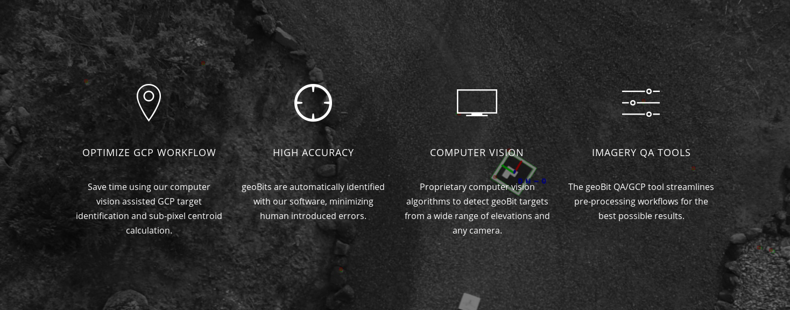
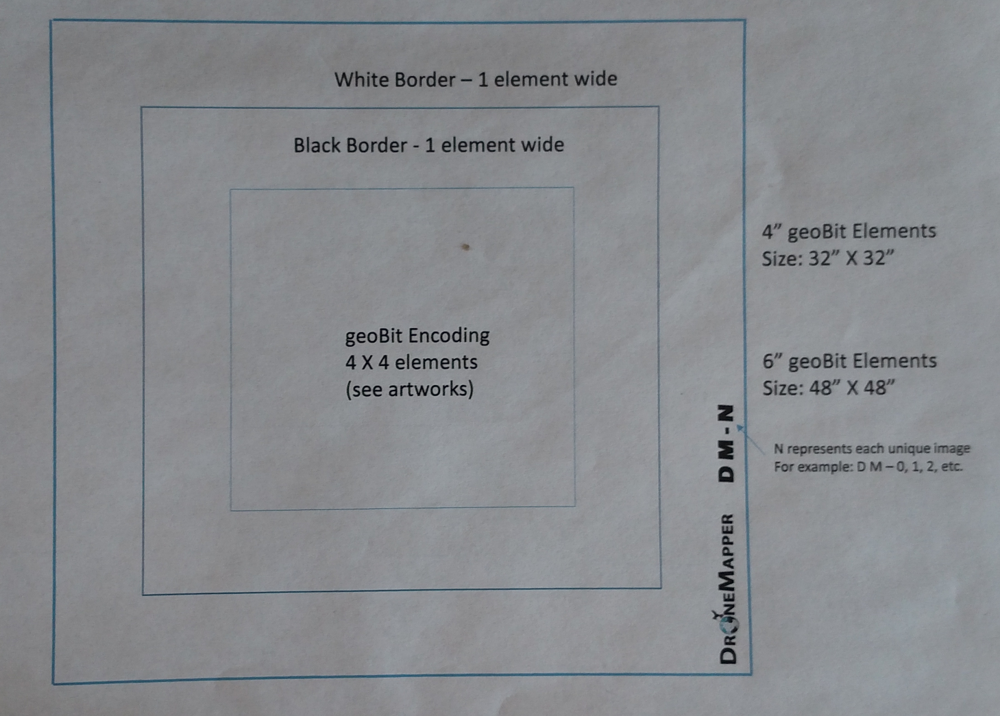
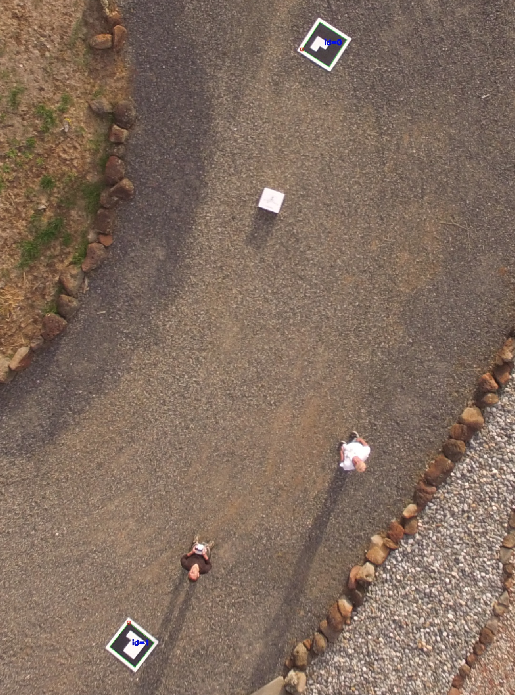

# geoBits: ArUco Ground Control Point (GCP) Targets and Detection for Aerial Imagery (UAV/MAV/SAT).
http://geobits.io 

https://dronemapper.com

TAGS: openCV, ArUco, QR Code, GCP, Drones, Ground Control Points, DroneMapper, Manned Aircraft, Aerial Imagery, Remote Sensing

#### Overview:

We've developed an aerial ground control point target system similar to a QR code. 
Our GCP targets are digitally encoded fiducial markers with computer vision software 
functionality to enhance workflows and provide the highest accuracy possible for 
photogrammetry missions.




#### Build:

Download and build opencv3 and opencv_contrib.

Next, build geoBits with the following commands:

```$ mkdir build ; cd build```

```$ export OpenCV_DIR=/opt/OPENCV3_DIR/; cmake ...```

```$ make```

#### Use:

```
$ ./build/drnmppr-detect-marker -d=0 -i=img/DJI_0040.JPG -l=0.161 -dp=detector_params.yml
DM-0 img/DJI_0040.JPG 1644.65 2391.85
DM-1 img/DJI_0040.JPG 2049.15 1130.93
```

#### Notes:

Printable 10000x10000 pixel markers are in the `markers` directory.



#### Cite Us:

If you use geoBits, please cite it as:

```
@misc{aruco-geobits,
  author = "JP Stoermer and Pierre Stoermer",
  title = "geoBits",
  howpublished = "\url{https://github.com/dronemapper-io/aruco-geobits}",
}
```

#### Contact:
JP Stoermer & Pierre Stoermer @ https://dronemapper.com

#### Screenshots:


Optional camera/sensor calibration:


#### Integrations & Uses:

- Integrated into DroneMapper Remote Expert GCP tool and QA tools (Windows 10) https://dronemapper.com
- Integrated into Bayer Crop Science UAV/MAV/SAT imagery processing pipeline (Private Cloud) https://bayer.com
- Used for various R&D missions and aerial image projects for DroneMapper.com and clients
- Used for various Agriculture R&D projects for AgEcoSystems, Syngenta and others
- Cited and included in patent submissions for Remote Oil Tank Volumetric Estimation